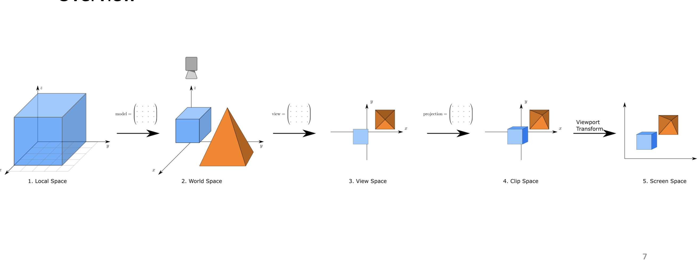

There's a pipeline which is usually applied to every object before it's got on a user screen.
It is not that straigtforward as it could be, but after realizing how it is deduced, it's getting much easier.
The reason of the following text is to finally figure out how all these things work under the hood. 

General view of the process

 

